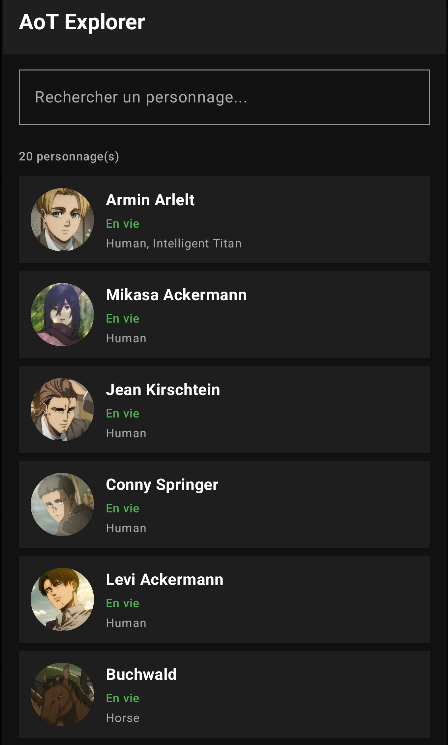

# Projet AoT Explorer

Application Android en Kotlin avec Jetpack Compose qui exploite une API REST publique dédiée à l'univers de l'anime L'Attaque des Titans.

**API :** https://api.attackontitanapi.com/

---



---

## Features

- Liste des personnages avec image, nom et statut
- Recherche en temps réel par nom
- Écran de détail complet
- Gestion des états Loading / Success / Error avec bouton Réessayer

---

## Structure du projet

```
app/src/main/java/com/example/aot_api/
model/          # Data classes
network/        # Interface Retrofit + RetrofitClient
viewmodel/      # CharacterViewModel
ui/             # Écrans Compose
navigation/     # NavHost + Routes
MainActivity.kt
```